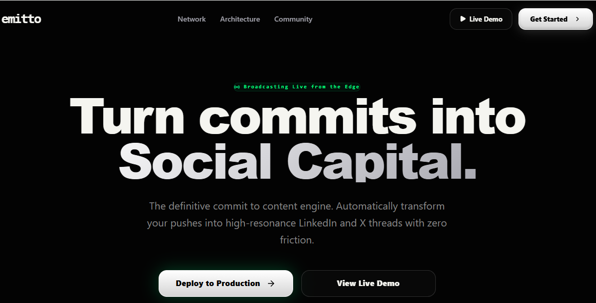
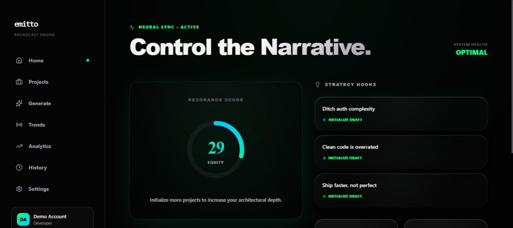
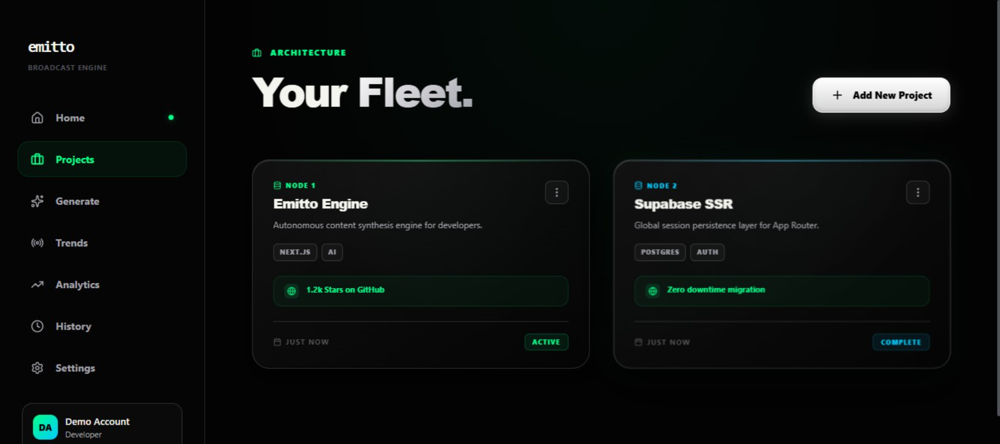
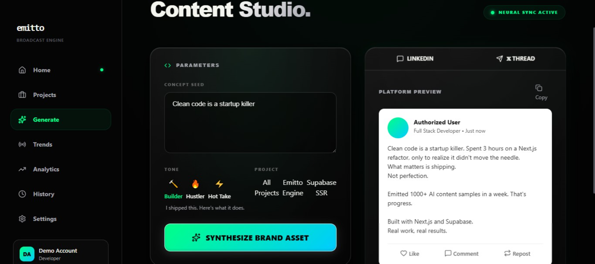
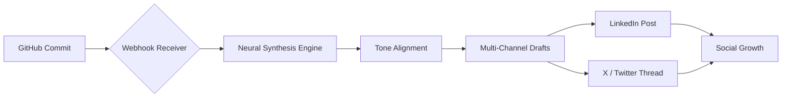

# Emitto: The Personal Broadcast Engine | AI Content Engine for Developers 🚀

**Turn Commits into Social Capital.** Emitto is a high-performance content synthesis engine designed for engineers who want to build a personal brand without the friction of manual content creation. It listens to your GitHub activity and automatically crafts high-resonance technical narratives for LinkedIn and X (Twitter).



## 📸 Platform Preview

<p align="center">
  
  
  
</p>

## ⚡ Key Features

- **Zero-Config Pipeline**: Connect your GitHub and let Emitto handle the rest. No complex setup, just pure commit to content automation.
- **Neural Voice Matching**: Advanced AI that learns your technical vocabulary and syntax to ensure every post sounds exactly like you.
- **Bento Intelligence Dashboard**: A premium, "deep dark" aesthetic interface providing real-time analytics on your brand resonance and social ROI.
- **Multi-Channel Synthesis**: Tailors content specifically for the unique algorithms of LinkedIn and X threads from a single source of truth.
- **Mobile-First Studio**: A fully responsive experience that allows you to approve, edit, and broadcast drafts from any device.

## 🔄 The Pipeline



## 🛠️ Technical Architecture

Emitto is built with a state-of-the-art stack focused on speed, security, and developer experience:

- **Framework**: [Next.js 15+](https://nextjs.org) with Turbopack & App Router
- **Runtime**: Node.js 20+
- **Database & Auth**: [Supabase](https://supabase.com)
- **AI Intelligence**: [Groq AI](https://groq.com) (Llama-3.3-70b-Versatile)
- **Styling**: Vanilla CSS with modern Glassmorphism and Mesh Gradients
- **Animations**: [Framer Motion](https://www.framer.com/motion/)
- **Icons**: [Lucide React](https://lucide.dev)

## 📊 Database Schema

| Table | Description | Key Fields |
|-------|-------------|------------|
| **Profiles** | User identity & brand settings | `user_id`, `voice_description`, `writing_samples`, `tracked_repos` |
| **Projects** | Detected engineering projects | `name`, `stack`, `status`, `learned`, `achievement` |
| **Posts** | Generated social narratives | `content_linkedin`, `content_x`, `tone`, `project_id`, `is_saved` |
| **Notifications** | Real-time system alerts | `type`, `message`, `cta_label`, `is_read` |

## 🚀 Getting Started

### Prerequisites

- Node.js 20.x or later
- A Supabase account and project
- A Groq API key

### Installation

1. **Clone the repository:**
   ```bash
   git clone https://github.com/miftah-ab/emitto.git
   cd emitto
   ```

2. **Install dependencies:**
   ```bash
   npm install
   ```

3. **Configure environment variables:**
   Create a `.env.local` file in the root directory:
   ```env
   NEXT_PUBLIC_SUPABASE_URL=your_supabase_url
   NEXT_PUBLIC_SUPABASE_ANON_KEY=your_supabase_anon_key
   GROQ_API_KEY=your_groq_api_key
   GITHUB_WEBHOOK_SECRET=your_secret_for_hmac
   ```

4. **Initialize the development server:**
   ```bash
   npm run dev
   ```

## 📐 Platform Structure

```text
/app         - Next.js App Router (Pages & API Routes)
/components  - High-fidelity UI components & Interactive Mockups
/lib         - Core Logic, Store Management & AI Prompt Engineering
/public      - Static assets & Branding
/styles      - Global Design System & Animations
```

## 🛡️ Security & Purity

Emitto adheres to the highest standards of modern web development:
- **React 19 Ready**: Implements strict render-phase purity and idempotency.
- **HMAC Verification**: Securely validates GitHub webhooks to prevent spoofing.
- **Production-Hardened**: Zero linting errors and a fully optimized build pipeline.

## 📄 License

This project is licensed under the MIT License.

---

**Built by engineers, for engineers. Broadcast your journey with Emitto.**
